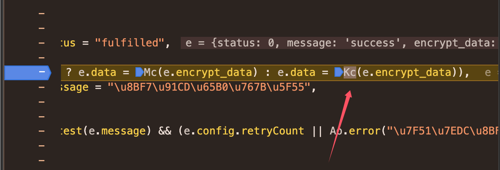

#### 逆向网址  https://wx.qmpsee.com/articleDetail?id=feef62bfdac45a94b9cd89aed5c235be

* 接口地址 https://wyiosapi.qmpsee.com/Web/getCaDetail

返回参数中encrypt_data字段为加密数据，需要解密

可以搜索关键字“encrypt_data”

发现在index.ca8b93b6.js文件下，设置断点重新运行，发现走了Kc的函数

进入Kc方法后，把Kc方法代码复制出来，里面又调用了Vc和rr.decode方法，都复制出来，就可以了。