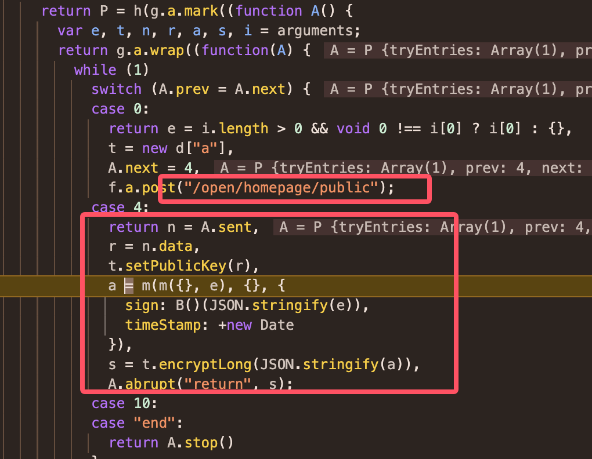
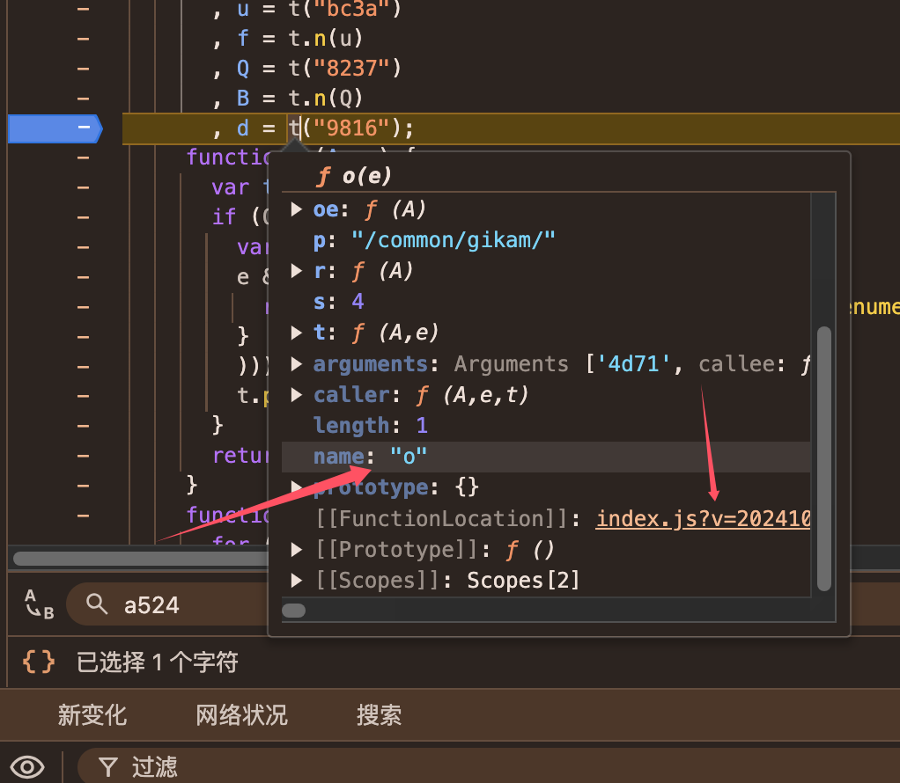
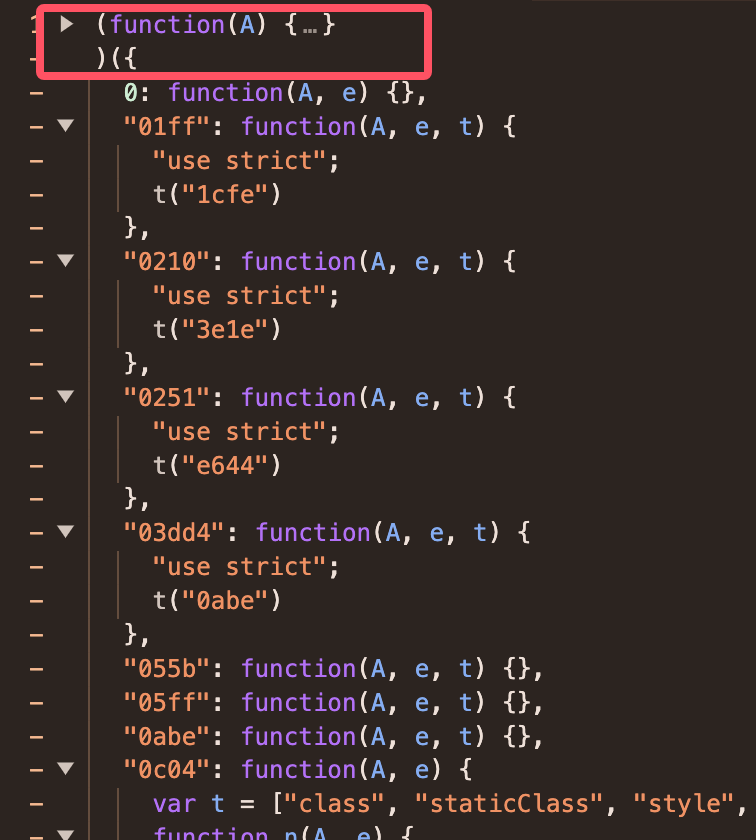
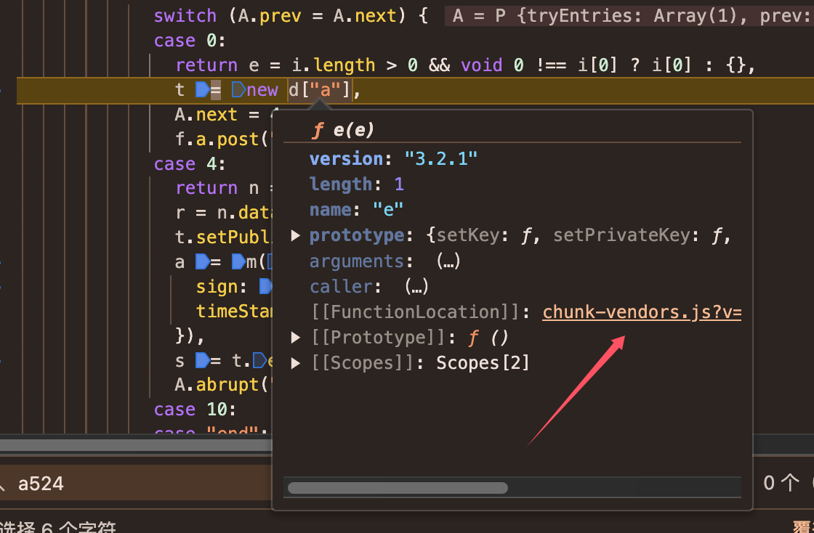
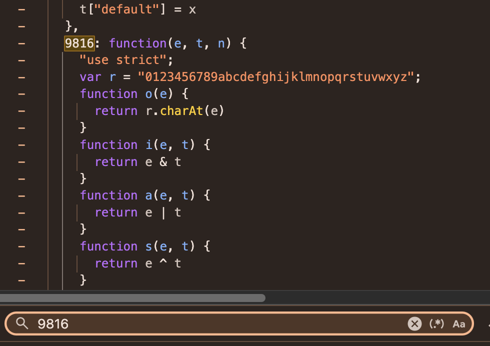

#### 逆向网址 https://ec.minmetals.com.cn/open/home/purchase-info

* 1 五矿会先请求一个`/open/homepage/public`获取一个密钥，在通过这个密钥去加密数据请求真实接口
* 2 这种情况可以先全局搜索`/public`

可以看出请求完public接口后，得到密钥，走到case4，请求的真实数据在e里面，通过B方法来解密数据最后得到s返回出去。<br>
我们可以先拷贝这几行加密的代码出来
```javascript
t = new d["a"],
t.setPublicKey(r),
a = m(m({}, e), {}, {
    sign: B()(JSON.stringify(e)),
    timeStamp: +new Date
}),
s = t.encryptLong(JSON.stringify(a))
```
分别去找对应的d, m, B方法的对应位置

* 首先往上翻找到d定义的地方：


* d = t("9816")，可以得出t是一个webpack的加载器，在这一行下断点，重新刷新网页，这样才会重新去加载加载器，进入断点，查看到t的真实姓名是叫o，点击跳到o的定义


* 跳转到o后往上翻，可以看到这是一个webpack的加载器，拷贝整个加载器代码出来，后面函数不需要，给一个空的{}即可


* 接着往下走，跳转到d["a"]的定义的js文件，全局搜索9816，可以找出这个函数，完整复制出来，拷贝到加载器中。



* 定义一个var myLoader;在加载器最后把o赋值给myLoader，这样就可以调用myLoader，顺便把window定义出来
```javascript
window = global;
var myLoader;
(function(A) {
    ...
    myLoader = o;
})({
    9816: function(e, t, n) {
        
    }
});
```

* 接着执行下d = myLoader("9816");发现48行报错
```shell
    return A[e].call(t.exports, t, t.exports, o),
                ^

TypeError: Cannot read properties of undefined (reading 'call')
```
在第48行前面加入代码console
```javascript
console.log(e)
return A[e].call(t.exports, t, t.exports, o)
```
打印e后发现还需要a524方法，同理拷贝出来放在9816后面。
* 接着找m方法，这个直接跳转链接拷贝出来即可，比较简单
* 然后是B方法，需要使用单步调试F9，一直跟进去发现这是一个md5算法。
* 