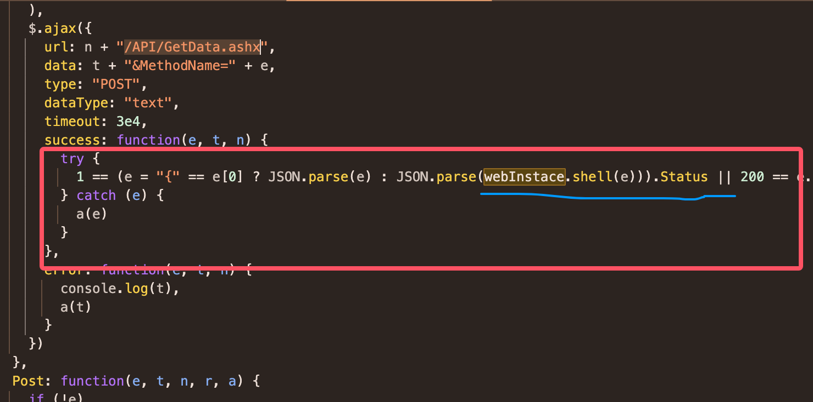

#### 逆向网址 https://www.endata.com.cn/BoxOffice/BO/Year/index.html


请求接口为 https://www.endata.com.cn/API/GetData.ashx  ，通过搜索decrypt结果比较多，定位难度较大，可以搜索关键字/API/GetData.ashx，找到请求的地方，可以看到这是一个jquery封装的请求，success就是对返回值的处理。关键方法在于`webInstace.shell(e)`


跳转到定义的方法可以发现是一个webDES.min.js文件，将代码全部拷贝出来，可以发现这个js文件最后会产生一个对象webInstace = new webDES();添加方法以下方法，传入加密的数据即可解密
```javascript
function enDecrypt(data) {
    return JSON.parse(webInstace.shell(data))
}
```

